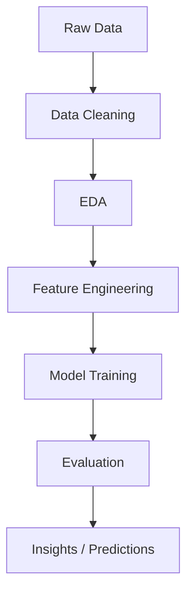

# Kaggle-Notebooks

# 📊 Data Science / Machine Learning Project

---

## 📌 Project Overview

This repository contains a portfolio-ready **Data Science / Machine Learning project**, originally developed on Kaggle and structured here for better accessibility, reproducibility, and version control.

It demonstrates an end-to-end workflow — from raw data processing to building and evaluating machine learning models.

---

## 🚀 Project Highlights

- ✨ End-to-end ML pipeline  
- 📊 Data analysis & visualization  
- 🤖 Model training, evaluation & optimization  
- 📁 Clean and structured repository  
- 🔁 Fully reproducible workflow  

---

## 🧠 Workflow

---
## 📌 Note

This projects were initially developed on Kaggle and later structured into this repository for better accessibility, version control, and portfolio presentation.

